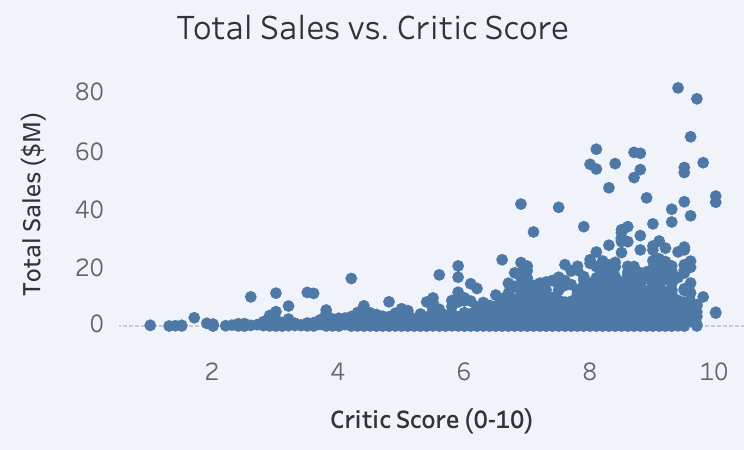
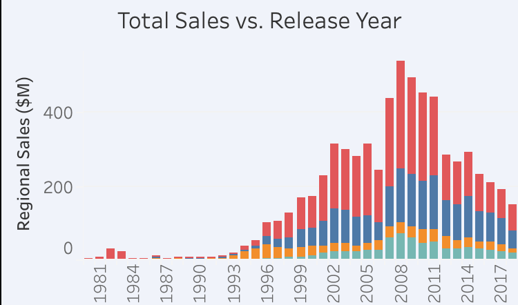

# 🎮 Video Game Sales Analysis — Global Market & Platform Strategy

> **Analyzing 60,000+ video game records from 1971–2024 to identify sales trends, platform opportunities, genre performance, and regional market differences.**

[](https://www.python.org/)
[](https://duckdb.org/)
[](https://www.tableau.com/)

---

## 📊 Dashboard

### Tableau Interactive Dashboard

**[View the Interactive Tableau Dashboard](https://public.tableau.com/views/vgsales_17878442519720/Dashboard?:language=en-US&:display_count=n&:origin=viz_share_link)**


The dashboard allows users to explore video game sales by:

- Release year
- Region
- Hardware ecosystem
- Genre
- Publisher

---

# 🎯 Project Overview

This project analyzes a dataset of more than **60,000 video game records released between 1971 and 2024**.

Rather than simply ranking the best-selling games, the analysis investigates how **platform, genre, critical reception, and geography** relate to commercial performance.

The project focuses on two business scenarios:

### 1. Platform & Product Strategy

> If a game producer had $100M to invest in a new studio or franchise, which platforms and genres would provide the strongest opportunities for global reach and commercial performance?

### 2. Regional Expansion Strategy

> How should a Western game publisher adjust its product and marketing strategy when expanding into Japan compared with North America and Europe?

---

# 🛠️ Tools & Technologies

| Tool | Purpose |
|---|---|
| **Excel** | Initial data exploration and validation |
| **Python / Pandas** | Reproducible data cleaning and validation |
| **SQL / DuckDB** | Data analysis and aggregation |
| **Tableau** | Interactive visualization and dashboarding |
| **GitHub** | Project documentation and version control |

---

# 🔄 Analysis Workflow

```text
Raw Dataset
↓
Excel Exploration & Validation
↓
Python / Pandas Cleaning
↓
Cleaned Dataset
↓
SQL Analysis
↓
Tableau Visualization
↓
Business Insights & Recommendations
```

---

# 🧹 Data Cleaning

The original dataset contained missing values, inconsistent data types, duplicate records, and formatting issues.

### Cleaning Process

- Inspected dataset structure and data types
- Removed unnecessary metadata columns
- Standardized categorical text fields
- Converted release dates to proper date formats
- Extracted release years for time-based analysis
- Identified and removed duplicate records
- Audited missing values
- Preserved meaningful `NULL` values rather than incorrectly replacing them with zero
- Validated regional sales against reported global sales
- Investigated outliers and unusual values

### Missing Value Strategy

Missing values were handled according to the meaning of each field.

For example:

- Missing critic scores were **not** converted to zero because zero represents a real score.
- Missing sales values were preserved as `NULL` rather than assuming the game had zero sales.
- Missing categorical information such as developer was represented as `Unknown` where appropriate.

This prevented unnecessary data loss and reduced the risk of introducing statistical bias.

---

# 🔎 SQL Analysis

SQL was used to investigate several analytical questions.

### Key analyses included:

**Top-selling games**

Identified the highest-selling individual game releases by global sales.

**Sales over time**

Analyzed annual game releases, total recorded sales, and average sales per title.

**Platform & genre specialization**

Grouped consoles into major hardware ecosystems and compared genre performance across them.

**Regional market differences**

Compared North American, European/PAL, Japanese, and other regional sales.

**Critical reception vs. sales**

Investigated the relationship between critic scores and commercial performance.

**Publisher efficiency**

Compared publishers based on release volume, total sales, average sales per title, and critic scores.

---

# 📈 Key Findings

## 1. Sony PlayStation Leads Overall Recorded Sales

Sony PlayStation platforms accounted for approximately **49% of the recorded sales** among the major hardware ecosystems analyzed.

Nintendo and Microsoft Xbox followed with approximately **23%** and **21%**, respectively.


---

## 2. Genre Preferences Differ Across Regions

North American and European markets showed particularly strong sales in:

- Action
- Sports
- Shooter

Japan showed relatively stronger performance in:

- Role-Playing
- Fighting
- Strategy

This suggests that regional markets should not necessarily be treated as having identical genre preferences.


---

## 3. Critical Reception Is Associated With Higher Average Sales

Games receiving higher critic scores tended to have higher average global sales.

The analysis found approximately:

| Critic Score | Average Global Sales |
|---|---:|
| 9.0+ | 2.08M |
| 8.0–8.9 | 1.10M |
| 7.0–7.9 | 0.58M |
| <5.0 | 0.27M |

This indicates a strong relationship between critical reception and average commercial performance in the dataset.

**Important:** This is an association, not proof that higher critic scores cause higher sales.



---

## 4. Recorded Sales Peaked Around 2008

The dataset shows the highest recorded annual global sales around **2008**, with approximately **$537.84M** in recorded sales.

However, this should **not** be interpreted as proof that the overall video game industry peaked in 2008.

The underlying data is heavily influenced by retail/physical software sales, while the industry increasingly shifted toward digital distribution, downloadable content, subscriptions, free-to-play models, and other forms of monetization.

Therefore, the decline in recorded sales after the peak is at least partially a **data-coverage limitation**.



---

# 💼 Business Recommendations

## Platform & Product Strategy

Based on the analysis, Sony PlayStation represents the largest recorded software market among the major hardware ecosystems.

Action, Sports, and Shooter titles also represent major sales categories across Western markets.

However, platform-level investment decisions should not be based solely on aggregate historical sales. Factors such as development cost, competition, audience demographics, current market share, and digital sales would need to be considered before making an actual $100M investment decision.

---

## Japanese Market Expansion

The analysis indicates that Japanese consumers have different genre preferences from North American and European consumers.

A publisher entering the Japanese market could therefore consider emphasizing:

- Role-Playing
- Fighting
- Strategy

rather than assuming that Western genre preferences will transfer directly to Japan.

The analysis also found substantially lower recorded Xbox sales in Japan compared with the other major ecosystems.

---

# ⚠️ Data Limitations

The results should be interpreted within the limitations of the dataset.

### Retail-focused sales data

The dataset is derived from VGChartz data, whose methodology notes limitations in estimating software sales as digital distribution became increasingly dominant.

VGChartz stopped producing software sales estimates after the end of 2018 because the growing digital market made retail estimates increasingly difficult to produce and less representative of overall game performance.

Therefore:

> **The sales figures should not be interpreted as a complete measure of total video game industry revenue, particularly for newer releases.**

### Other limitations

- Some games have missing release dates.
- Critic scores are missing for many titles.
- Regional sales are estimates rather than a complete census of global sales.
- The dataset may have inconsistent coverage across years and platforms.
- Sales do not include every modern form of video game monetization.

These limitations are particularly important when interpreting trends after approximately 2013–2018.

---

# 📁 Repository Structure

```text
vg-sales-analysis/
│
├── README.md
│
├── images/
│   ├── dashboard.png
│   ├── hardware_distribution_pie.png
│   ├── regional_market_sales.png
│   ├── critic_score_sales.png
│   └── sales_vs_year.png
│
├── vg_data_clean.ipynb
├── vg_data_analysis.ipynb
├── vg_data_dictionary.csv
│
├── vgchartz-2024.csv
├── vgchartz_cleaned(Pandas).csv
│
├── vg_notes.md
└── vg_report.md
```

---

# 📚 Project Documentation

For a detailed walkthrough of the project:

- **[Data Cleaning Notebook](vg_data_clean.ipynb)**
- **[Data Analysis Notebook](vg_data_analysis.ipynb)**
- **[Data Dictionary](vg_data_dictionary.csv)**
- **[Detailed Project Report](vg_report.md)**
- **[Project Notes](vg_notes.md)**

### Dataset

The dataset was obtained from the Kaggle **Video Game Sales 2024** dataset:

**[Kaggle Dataset](https://www.kaggle.com/datasets/asaniczka/video-game-sales-2024)**

The underlying sales methodology can be found on **[VGChartz](https://www.vgchartz.com/methodology.php)**.

---

# 🚀 What I Learned

This project gave me hands-on experience with an end-to-end data analysis workflow:

- Cleaning a large, messy dataset
- Handling missing values without introducing bias
- Validating data quality
- Writing analytical SQL queries
- Creating calculated fields
- Building interactive Tableau dashboards
- Translating analytical results into business recommendations
- Documenting data limitations

One of the biggest lessons from the project was that **data analysis does not end when the data is cleaned**. Results must also be validated between the analysis layer and visualization layer to ensure that the numbers being communicated are consistent.

---

# 🔮 Future Improvements

Future projects will build on this workflow by:

- Working with multiple related tables
- Performing more advanced statistical analysis
- Incorporating web-scraped or API-based data
- Building more complex data pipelines
- Developing additional business-focused analytical questions before beginning the cleaning and visualization stages

---