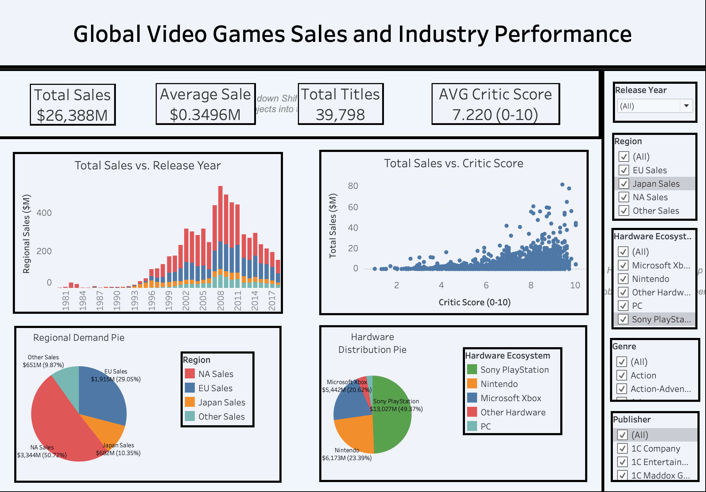
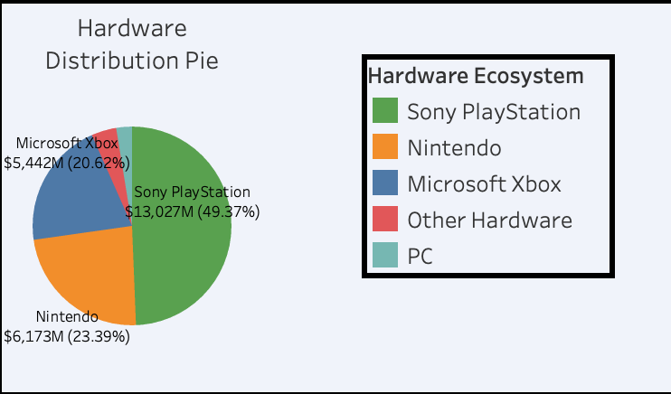
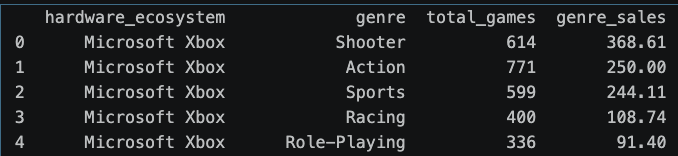
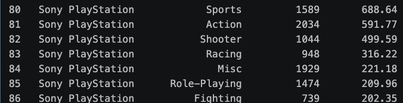
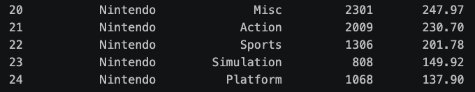
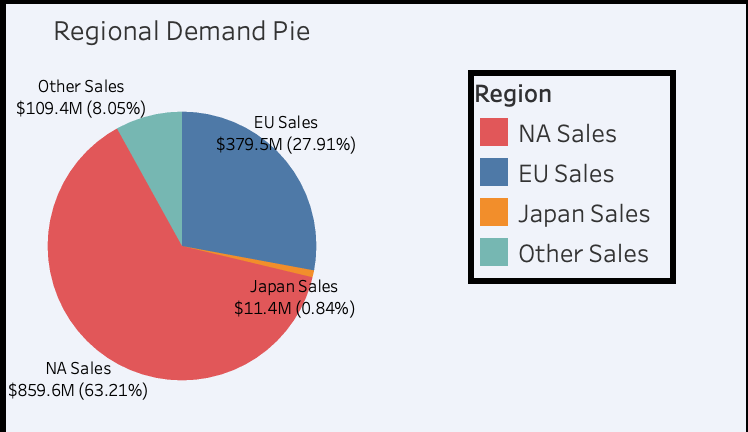
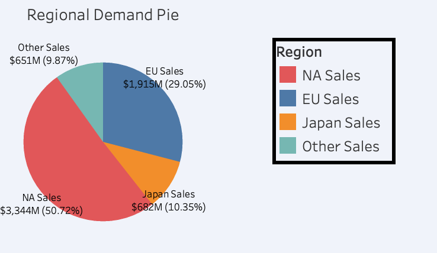
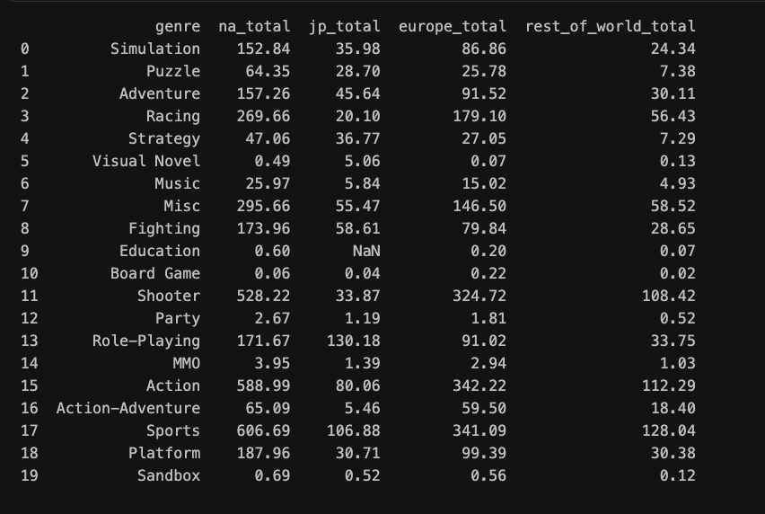

# Data Analysis Report: Global Video Game Industry Strategy (1971–2024)

## Overview of Report

This report details the data cleaning, exploration, analysis, and visualization of Video Game Sales data from 1971 through 2024. All these steps across 60,000+ records aim to address two important business questions:

1. **Core Question: Product Strategy & Platform Selection:** "If a lead games producer has $100M to build a new game studio or acquire an existing franchise, which genre and platform combinations give the game the best chance of attracting a massive player base, succeeding in multiple global regions, and earning strong review scores?"
2. **Expansion Question: Audience & Regional Localization:** How should a Western game publisher adjust its release catalog and marketing allocation when expanding into Japanese markets versus European and North American markets?


## Table of Contents
* **0. My Exprience/Thoughts Through This Project**
* **1. Data Cleaning and Exploration**
* **2. Analytical SQL Engineering & Query Architecture**
* **3. Data Visualization - Tableau Dashboard**
* **4. Strategic Business Answers & SQL/Visualization Synthesis**


## 0. My Experience/Thoughts Throughout This Project

This was the first data analysis project I created on my own, using Excel/Pandas, SQL, and Tableau.
Before, I just watched a few video tutorials to get familiar with these tools, but now I have some hands-on practice!

Building this project on my own has helped me get much more familiar with these technical tools.

I did originally build this project with the main goal of improving my technical skills for data analaysis, but now I've also gotten much more familiar with the workflow of data analysis.

I got this project idea from https://mavenanalytics.io/data-playground/video-game-sales.

---

At first, I just downloaded the dataset and tried cleaning the dataset, using Excel and Pandas separately.

Then, I wrote SQL queries to answer the recommend KPI (key-performance index) questions from that website.

Then, I created the Tableau dashboard with visualizations and interactive filters.

It was after I did all this that I thought of two business questions that I could answer, so my SQL queries and Tableau visualizatoins combined together aren't as related to the two business questions as they could be.

---

In future projects, I want to practice working with multi-table data and to come up with 2-3 business questions before doing any data cleaning, querying, and visualizing.

In this project, I also noticed some inconsistency between the numbers from my SQL queries and my Tableau visualizations. So, I learned that checking that your data for consistency is still important even after data cleaning when you're writing queries/creating visualizations, to make sure that there's no errors.

After I do 1-2 more projects with data cleaning, querying, and visualizing, I want to try building more end-to-end data projects like with data scraping, data engineering, AI, etc.


## 1. Data Cleaning and Exploration

**Dataset Source:**
https://www.kaggle.com/datasets/asaniczka/video-game-sales-2024

Before downloading the dataset, I looked at how the how the dataset was collected.

**Data-Collection Methodology:**
https://www.vgchartz.com/methodology.php

The methodology says importantly, that:
* Since the end of 2018 VGChartz no longer produces estimates for software sales. This is because the high digital market share for software was making it both more difficult to produce reliable retail estimates and also making those estimates increasingly unrepresentative of the wider performance of the games in question.

Essentially, when the closer the data gets to 2018 and after 2018, the data becomes much more unreliable.

Thus, this dataset is kind of outdated, and would be more useful for people back in 2018 or in earlier years.

---

The raw Video Game Sales records contained several schema inconsistencies, mixed data types, unescaped string characters, and missing dates. Left unaddressed, these issues cause SQL quieres to default numeric columns to generic text types or fail during aggregate computations.

I practiced cleaning the dataset using both Excel and Pandas, and I decided on using the Pandas cleaned dataset for future SQL quering and PowerBI/Tableau visualization.

I think a combination of both Excel and Pandas would be the best for future data analysis projects.

---

### (Excel)

To prepare the raw Video Games Sales dataset for SQL querying and PowerBI/Tableau dashboarding, a multi-phase data auditing, validation, and transformation workflow was performed in Excel. The data cleaning methodology followed three strict phases: schema preparation, automated error auditing, and standardization.

#### Phase 1: Schema Setup & Metadata Auditing

*   **Duplicate Sheet Backup:** Created an untouched backup worksheet before running transformations to preserve data lineage and establish a recovery baseline.
*   **Explicit Data Type Mapping:** Converted all raw columns from generic default types (`General`) to explicit structural formats (`Text`, `Decimal`, and `Date`).
*   **Feature Engineering:** Extracted `release_year` using a conditional date expression (`=IF(ISBLANK(release_date), "", YEAR(release_date))`) to enable macro-level temporal grouping in downstream queries.
*   **Column Pruning:** Identified and removed non-analytical system metadata fields, specifically image paths (`img`) and system refresh timestamps (`last_updated`), to optimize storage and schema cleanliness.

#### Phase 2: Integrity Validation & Text Standardization

*   **Mathematical Cross-Validation:** Verified the internal arithmetic accuracy of reported gross sales using an absolute-difference verification formula:
    
    $$\text{Validation Check} = \text{IF}\left(\text{ABS}\left(\text{total\_sales} - \left(\text{na\_sales} + \text{jp\_sales} + \text{pal\_sales} + \text{other\_sales}\right)\right) < 0.5, \text{"Valid"}, \text{"Mismatch"}\right)$$
    
    The audit confirmed 100% mathematical consistency across all regional sales breakdowns.
*   **Deduplication Audit:** Executed a multi-field count check (`=COUNTIFS(title, A2, console, B2, release_date, C2)`) to identify duplicate game releases, successfully purging identical records matching on title, console, and release date.
*   **Text Cleansing & Normalization:** Standardized string syntax across all categorical columns (`title`, `console`, `genre`, `publisher`, `developer`) by applying `=PROPER(TRIM(cell))`. Validation formulas confirmed that fewer than 0.2% of entries contained formatting anomalies or redundant whitespace.
*   **Temporal Auditing:** Standardized all date entries to ISO-8601 format (`YYYY-MM-DD`). Audited all date fields for out-of-range, future, or invalid calendar values; zero parsing errors were detected.

#### Phase 3: Missing Value Strategy & Audit Summary

Using `=COUNTBLANK()` and conditional column filters, missing data distributions were cataloged across all attributes to establish clear retention rules:

| Column Name | Data Type | Null Percentage | Handling Strategy | Justification |
| :--- | :--- | :--- | :--- | :--- |
| `title`, `console`, `genre` | `Text` | **0.0%** | Retained | Complete categorical metadata |
| `publisher`, `developer` | `Text` | **0.0%** | Retained | Complete attribution coverage |
| `release_date` | `Date` | **10.0%** | Retained (`NULL`) | Preserved for non-temporal sales aggregations |
| `sales_columns` | `Decimal` | **70.0%** | Retained (`NULL`) | Preserved non-commercial software entries |
| `critic_score` | `Decimal` | **90.0%** | Retained (`NULL`) | Retained to prevent sample bias on unrated games |

> **Audit Insight:** Deleting rows with missing sales or review scores would have eliminated over 70% of the entire dataset. To prevent severe sample bias, missing values were preserved as explicit `NULL` entries. This allowed catalog size metrics to remain accurate while ensuring SQL aggregate functions (`AVG`, `SUM`) evaluate true underlying samples on the other non-NULL fields without skewing.

---

### (Pandas)

To scale data preparation beyond manual spreadsheet workflows, a programmatic data auditing, validation, and cleaning pipeline was implemented in Python using the `pandas` framework. This programmatic approach ensured reproducible data transformations, memory optimization, and vector-accelerated arithmetic verification.

#### Phase 1: Exploratory Data Analysis & Schema Diagnostics

Prior to transformation, automated diagnostics were executed to establish baseline dimensions, catalog null distributions, and evaluate categorical cardinality.

*   **Dimensionality & Type Mapping:** Loaded the raw CSV via `pd.read_csv()` and inspected dataset dimensions (`df.shape`) alongside explicit data type declarations and memory footprints (`df.info()`).
*   **Null Value Distribution Logging:** Quantified missing/NULL values per attribute using `df.isna().sum()` to confirm structural integrity patterns observed during spreadsheet auditing.
*   **Boundary & Outlier Inspection:** Executed `df.describe()` across all numerical frields (`total_sales`, `na_sales`, `jp_sales`, `pal_sales`, `other_sales`, and `critic_score`) to verify minimum, maximum, median, and interquartile ranges ($Q_1$ and $Q_3$), identifying distribution skews and unrated baseline boundaries.
*   **Categorical Cardinality Check:** Evaluated target categorical fields (`genre`, `console`) via `.nunique()` and `.value_counts()` to identify low-frequency entry anomalies, formatting discrepancies, and unique category counts.

#### Phase 2: Programmatic Cleansing & Vectorized Transformations

Transformations were applied using vectorized operations to optimize processing performance and maintain code reproducibility across execution environments.

*   **Schema Pruning:** Removed non-analytical system attributes (`img`, `last_update`) using `df.drop(columns=[...])` to trim memory overhead.
*   **Granular Deduplication:** Eliminated redundant software entries using multi-column subset matching (`df.drop_duplicates(subset=['title', 'console'], keep='first')`), retaining initial release instances.
*   **String Normalization:** Stripped leading and trailing whitespace across all categorical attributes using a lambda iteration over string series:
    
    ```python
    string_cols = ['title', 'publisher', 'developer', 'genre', 'console']
    df[string_cols] = df[string_cols].apply(lambda col: col.str.strip())
    ```
*   **ISO-8601 Date Coercion:** Converted the raw string date values into native pandas datetime objects (`pd.to_datetime(..., errors='coerce')`). This allowed robust extraction of calendar years while safely coercing malformed dates to `NaT` (Not a Time).

#### Phase 3: Missing Value Engineering & Vectorized Logic Validation

To prevent statistical distortion during analytical SQL modeling, missing values were handled based on domain-specific requirements rather than blanket deletion.

*   **Numeric & Categorical Imputation Rules:**
    *   **Commercial Sales Fields:** Null entries in (`total_sales`, `na_sales`, `jp_sales`, `pal_sales`, `other_sales`, and `critic_score`) were preserved as NULL to ensure future SQL queries can still aggregate on the non-NULL fields in those rows with NULL entries.
    *   **Developer Categorical Metadata:** Missing text fields in `developer` were populated with a standard `'Unknown'` placeholder.
    *   **Review Score Integrity:** Preserved missing `critic_score` entries as native `NaN` values. Imputing zero or mean values would introduce severe bias into downstream review quality analyses.
*   **Vectorized Arithmetic Verification:** Verified cross-column financial integrity by comparing reported total revenue against the sum of regional metrics using row-wise vector addition:

$$\text{Discrepancies} = \left(\left\vert{} \text{total\_sales} - \sum \text{regional\_sales} \right\vert{} < 0.5 \right)$$

---

### Conclusion of Cleaned Dataset (Pandas)

Following rigorous auditing and multi-stage cleansing across both Excel and Python (Pandas) workflows, the final dataset comprises a fully standardized, leak-free corpus of 60,000+ historical video game records spanning 1971 through 2024. 

All categorical text fields (`title`, `console`, `genre`, `publisher`, `developer`) are fully populated, trimmed of whitespace, and normalized to standard casing, while system metadata (`img`, `last_updated`) and duplicate entries matching on title, console, and release date have been completely purged. 

Temporal attributes are formatted to ISO-8601 dates (`YYYY-MM-DD`) with engineered release years, and gross sales figures have been programmatically cross-validated to be 100% mathematically aligned with regional breakdowns (`na_sales`, `jp_sales`, `pal_sales`, `other_sales`). 

Crucially, missing review ratings (`critic_score`) and unlisted sales values were preserved as structural `NULL`/`NaN` entries rather than arbitrarily imputed, maintaining strict mathematical integrity for downstream SQL aggregations and executive PowerBI/Tableau visualizations.


## 2. Analytical SQL Engineering & Query Architecture

To bypass traditional CLI limitations where engines interpret incoming CSV columns as plain text, clean memory frames were ingested directly into DuckDB SQL using memory-mapping connections, automatically inferring DOUBLE, VARCHAR, and DATE column types.

Multiple SQL queries were written in DuckDB Python/SQL to analyze the cleaned dataset, utitilizing conditional aggregation, date extraction, window functions, and multi-tier CASE expressions.

The analysis evaluated commercial drivers, platform performance, regional market dynamics, and portfolio efficiency.

### Query 1: Top 10 Software Releases Worldwide

**Objective:** Identify the highest-grossing individual game releases across all platforms.

```sql
SELECT 
    title, 
    console, 
    publisher, 
    total_sales
FROM 'vgchartz_cleaned(Pandas).csv'
WHERE total_sales IS NOT NULL
ORDER BY total_sales DESC
LIMIT 10;
```

**Key Analytical Findings:** Blockbuster titles such as Grand Theft Auto V (across PS3, PS4, and X360) and Call of Duty releases (PS4 and X360) dominate individual software performance, with top-tier titles reaching between 13.80 and 20.32 million sales per platform release.

### Query 2: Industry Temporal Growth & Annual Sales Trends

**Objective:** Measure macro industry expansion by tracking total volume of software releases, yearly aggregate sales, and average sales yield per title

```sql
SELECT 
    YEAR(CAST(release_date AS DATE)) AS release_year,
    COUNT(title) AS games_released,
    ROUND(SUM(total_sales), 2) AS yearly_global_sales,
    ROUND(AVG(total_sales), 2) AS avg_sales_per_game
FROM 'vgchartz_cleaned(Pandas).csv'
WHERE release_date IS NOT NULL 
  AND total_sales IS NOT NULL
GROUP BY release_year
ORDER BY release_year ASC;
```

**Key Analytical Findings:** Annual software volume peaked between 2007 and 2011, reaching a high of 1,751 catalog releases in 2009 and peak global revenue of $537.84 million in 2008. However, earlier software eras (e.g., 1989–1990) maintained higher average software yields (~$1.30M per title) due to less market saturation.

### Query 3: Hardware Ecosystem Specialization by Genre

**Objective:** Examine software catalog distribution across major hardware ecosystems (PlayStation, Xbox, Nintendo, PC, Other Hardware) to determine genre specialization.

```sql
SELECT 
    CASE 
        WHEN console IN ('PS', 'PS2', 'PS3', 'PS4', 'PS5', 'PSP', 'PSV') THEN 'Sony PlayStation'
        WHEN console IN ('XB', 'X360', 'XOne', 'XSX') THEN 'Microsoft Xbox'
        WHEN console IN ('N64', 'GC', 'Wii', 'WiiU', 'NS', 'GB', 'GBA', 'DS', '3DS') THEN 'Nintendo'
        WHEN console = 'PC' THEN 'PC'
        ELSE 'Other Hardware'
    END AS hardware_ecosystem,
    genre,
    COUNT(title) AS total_games,
    ROUND(SUM(total_sales), 2) AS genre_sales
FROM '{csv_file}'
GROUP BY hardware_ecosystem, genre
ORDER BY hardware_ecosystem, genre_sales DESC
```

**Key Analytical Findings:** I found which genres had the most sales in each Hardware Ecosystem. Data from this query is talked about more below.

### Query 4: Regional Market Divergence (Japanese Regional Favorites)

**Objective:** Isolate regional high-performers by identifying games with substantial regional domestic adoption (>= 1.0M sales). In this case, the specific region is Japan.

```sql
SELECT 
    title, 
    console, 
    genre, 
    jp_sales, 
    na_sales,
    pal_sales
FROM 'vgchartz_cleaned(Pandas).csv'
WHERE jp_sales >= 1.0 
ORDER BY jp_sales DESC
LIMIT 10;
```

**Key Analytical Findings:** Titles such as Famista '89, Dragon Quest XI, Super Puyo Puyo, and Tomodachi Collection yielded over 1.5M sales in Japan while recording zero or negligible sales in Western markets (NA / PAL), demonstrating distinct regional consumption behaviors.

### Query 5: Critical Acclaim vs. Commercial Impact

**Objective:** Assess whether high critical review scores directly correlate with increased global unit sales.

```sql
SELECT 
    CASE 
        WHEN critic_score >= 9.0 THEN '9.0+ (Masterpiece)'
        WHEN critic_score >= 8.0 THEN '8.0-8.9 (Great)'
        WHEN critic_score >= 7.0 THEN '7.0-7.9 (Good)'
        WHEN critic_score >= 5.0 THEN '5.0-6.9 (Average)'
        ELSE 'Under 5.0 (Poor)'
    END AS review_tier,
    COUNT(title) AS total_games,
    ROUND(AVG(total_sales), 2) AS avg_global_sales,
    ROUND(MAX(total_sales), 2) AS top_selling_game_in_tier
FROM 'vgchartz_cleaned(Pandas).csv'
WHERE critic_score IS NOT NULL 
  AND total_sales IS NOT NULL
GROUP BY review_tier
ORDER BY avg_global_sales DESC;
```

**Key Analytical Findings:** Critical quality displays a strong positive relationship with sales volume: "Masterpiece" titles (9.0+) average 2.08 million sales per title, compared to 1.10M for "Great" (8.0–8.9), 0.58M for "Good" (7.0–7.9), and 0.27M for "Poor" (<5.0).

### Query 6: Regional Preference Index by Genre

**Objective:** Aggregate regional revenue distributions across all game genres.

```sql
SELECT 
    genre,
    ROUND(SUM(na_sales), 2) AS na_total,
    ROUND(SUM(jp_sales), 2) AS jp_total,
    ROUND(SUM(pal_sales), 2) AS europe_total,
    ROUND(SUM(other_sales), 2) AS rest_of_world_total
FROM '{csv_file}'
WHERE total_sales IS NOT NULL
GROUP BY genre
```

**Key Analytical Findings:** North America and Europe generate the vast majority of volume in Action ($588.99M NA, $342.22M PAL), Sports ($606.69M NA, $341.09M PAL), and Shooter ($528.22M NA, $324.72M PAL). Conversely, Japan represents a significantly higher proportion of total sales in Role-Playing ($130.18M JP vs. $171.67M NA).

### Query 7: Publisher Portfolio Efficiency

**Objective:** Measure publisher performance and title efficiency for major publishers (minimum 50 releases).

```sql
SELECT 
    publisher,
    COUNT(title) AS total_releases,
    ROUND(SUM(total_sales), 2) AS global_revenue,
    ROUND(AVG(total_sales), 2) AS avg_revenue_per_title,
    ROUND(AVG(critic_score), 2) AS avg_critic_rating
FROM 'vgchartz_cleaned(Pandas).csv'
WHERE total_sales IS NOT NULL
GROUP BY publisher
HAVING COUNT(title) >= 50
ORDER BY avg_revenue_per_title DESC
LIMIT 15;
```

**Key Analytical Findings:** Rockstar Games leads in portfolio efficiency with an average yield of 2.58M sales per title across 93 title releases. High-volume publishers such as Activision (1,043 titles released; 0.69M sales avg) and Electronic Arts (843 titles released; 0.76M sales avg) maintain large revenue totals through volume strategies.

### Query 8: Hardware Ecosystem Comparison

**Objective:** Consolidate hardware platforms into primary brand ecosystems (Sony, Microsoft, Nintendo, PC, Other) to compare overall catalog size and sales.

```sql
SELECT 
    CASE 
        WHEN console IN ('PS', 'PS2', 'PS3', 'PS4', 'PS5', 'PSP', 'PSV') THEN 'Sony PlayStation'
        WHEN console IN ('XB', 'X360', 'XOne', 'XSX') THEN 'Microsoft Xbox'
        WHEN console IN ('N64', 'GC', 'Wii', 'WiiU', 'NS', 'GB', 'GBA', 'DS', '3DS') THEN 'Nintendo'
        WHEN console = 'PC' THEN 'PC'
        ELSE 'Other Hardware'
    END AS hardware_ecosystem,
    COUNT(title) AS total_catalog_size,
    ROUND(SUM(total_sales), 2) AS total_sales,
    ROUND(AVG(total_sales), 2) AS avg_sales_per_game
FROM 'vgchartz_cleaned(Pandas).csv'
WHERE total_sales IS NOT NULL
GROUP BY hardware_ecosystem
ORDER BY total_sales DESC;
```

**Key Analytical Findings:** Sony PlayStation leads total aggregate sales at $3,256.71M across 7,511 recorded releases. Microsoft Xbox platforms generate the highest software yield per title (0.51M sales/game across 2,660 releases), while PC exhibits the largest long-tail distribution with low physical sales unit averages (0.11M sales/game across 1,560 titles) due to digital distribution shifts.


## 3. Data Visualization - Tableau Dashboard
Following the SQL analytical modeling, I practiced visualizing the cleaned dataset using Tableau to provide executive stakeholders with an interactive, exploratory dashboard.

The below details my process of constructing the Tableau dashboard.

Link to Tableau Dashboard: https://public.tableau.com/views/vgsales_17878442519720/Dashboard?:language=en-US&:sid=&:redirect=auth&:display_count=n&:origin=viz_share_link




### 1. Data Manipulation
* **Calculated Fields & Feature Engineering:** 
  * **Hardware Ecosystem Aggregation:** Grouped granular console designations (such as PS1, PS2, PS3, PS4, PS5, PSP, and PSV) into high-level strategic buckets (`Hardware Ecosystem`) using custom logic:
    * **Sony PlayStation:** PS, PS2, PS3, PS4, PS5, PSP, PSV
    * **Microsoft Xbox:** XB, X360, XOne, XSX
    * **Nintendo:** N64, GC, Wii, WiiU, NS, GB, GBA, DS, 3DS
    * **PC:** PC
    * **Other Hardware:** Arcade, Atari, SNES, NES, and third-party legacy hardware.

### 2. Worksheet Design & Visualization Strategy
* **Executive KPI Banner:** Constructed 4 single-value statistical cards positioned along the top header to establish macro benchmarks:
  * **Total Sales:** $26,388M in aggregated software revenues across all recorded markets.
  * **Average Sale per Title:** $0.3496M yield per individual game title.
  * **Total Titles:** 39,798 distinct titles indexed within the analytical database.
  * **Average Critic Score:** 7.220 / 10 baseline industry review average.

* **Total Sales vs. Release Year (Stacked Column Chart):** Visualized macro industry growth and historical revenue expansion over time. Bars are color-coded by region (North America, Europe, Japan, Other) to illustrate regional shifts across console generations.
* **Total Sales vs. Critic Score (Scatter Plot):** Plotted game-level critic scores against total worldwide sales to analyze the relationship between critical acclaim and commercial yield.
* **Regional Demand Pie Chart:** Built a proportional pie chart showcasing global market distribution, complete with custom labels showing raw dollar volume and percentage market share.
* **Hardware Distribution Pie Chart:** Formatted a pie chart evaluating total revenue share captured across major console manufacturers and hardware lines.

* **Interactive Control Sidebar:** Built a unified right-hand control panel with global filters, including for **Release Year**, **Region**, **Hardware Ecosystem**, **Genre**, and **Publisher**.


## 4. Strategic Business Answers & SQL/Visualization Synthesis

Synthesizing SQL queries and Tableau dashboard visualizations provides data-driven answers to both business scenarios.

### Core Question: Product Strategy & Platform Selection ($100M Capital Deployment)

> **Scenario:** "If a lead games producer has $100M to build a new game studio or acquire an existing franchise, which genre and platform combinations give the game the best chance of attracting a massive player base, succeeding in multiple global regions, and earning strong review scores?"

#### SQL Query & Dashboard Evidence
* **Ecosystem Reach:** The *Hardware Distribution Pie Chart* shows **Sony PlayStation** leads global software volume ($13,027M / 49.37% share), followed by **Nintendo** ($6,173M / 23.39%) and **Xbox** ($5,442M / 20.62%).

 

* **Genre Sales:** Query 3 from the SQL section above about Hardware Ecosystem Specialization by Genre show that the **Action**, **Sports**, and **Shooter** genres generate peak console sales.

 





* **Additional Filtering:** Through additional filtering on my Tableau dashboard, I filtered on just Microsoft Xbox under the Hardware Ecosystem filter, which showed me that there's relatively few Xbox sales in Japan.



### Executive Recommendation: 

Deploy the $100M budget across these 3 strategic areas to make use of the analysis above and to diversity with multiple choices:
* Spend **$50M** on Sony Playstation games, specifically with the genres Action, Sports, and Shooter.
* Spend **$25M** on Nintendo games, specifically with the genres Actions and Sports.
* Spend **25M** on Xbox games, specifically with the genres Action, Sports, and Shooter. Additionally, make sure to never deploy money on Xbox games within Japan.

---

### Expansion Question: Audience & Regional Localization

> **Scenario:** "How should a Western game publisher adjust its release catalog and marketing allocation when expanding into Japanese markets versus European and North American markets?"

#### SQL Query & Dashboard Evidence

* **Context:** The Regional Demand Pie Chart shows North America (50.72%) and Europe (29.05%) make up 79.77% of global sales, favoring Action ($931.21M combined), Sports ($947.78M), and Shooters ($852.94M).




* **Most Popular Genres in Japan:** Query 6 from the SQL section above about Regional Market Sales by Genre shows that in Western Markets like **North America (NA) and Europe (PAL): Action, Sports, and Shooter are the most popular genres**. **In Japan's markets: Role-Playing, Fighting, and Strategy are the most popular genres**.



* **Additional Note:** I checked how Regional Market Sales may vary by Hardware Ecosystem, and I didn't find much variance. The only thing I found was already stated above, which is that there's few Xbox sales in Japan.

### Executive Recommendation: 
When expanding into Japanese markets, make sure to focus on publishing games that specialize in the Role-Playing, Fighting, and Strategy genres instead, as those genres have the most sales in dollar value. Also, make sure to never publish games on Microsoft Xbox, as there's few Xbox sales in Japan.

---

## End of the Report!!!